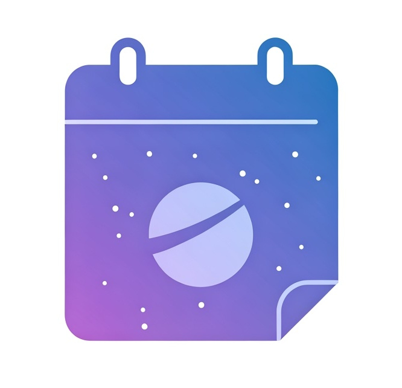

# Calendar App


A simple crud app for a calendar api.


## Setup
Copy `.env.test` as `.env` and customize your environment variables as desired, then choose your preferred method:

- [From scratch](./docs/setup/scratch.md)
- [Docker-compose](./docs/setup/docker-compose.md)
- [Kubernetes](./docs/setup/kubernetes.md)
- [Terraform/OpenTofu](./docs/setup/terraform.md) 


### If you're using Kubernetes
Assuming you have Kubernetes installed

Install CloudNativePG which supports the full lifecycle of a highly available PostgreSQL database cluster with a primary/standby architecture:
```
kubectl apply --server-side -f \
  https://raw.githubusercontent.com/cloudnative-pg/cloudnative-pg/release-1.25/releases/cnpg-1.25.0.yaml
```

Install Atlas for kubernetes based database migrations
```
helm install atlas-operator oci://ghcr.io/ariga/charts/atlas-operator
```

## Contributing
TODO: just put this in github actions for convenience: 

To build and push to a github container registry, first get a [PAT token](https://docs.github.com/en/authentication/keeping-your-account-and-data-secure/managing-your-personal-access-tokens) from Github
```
export CR_PAT=YOUR_TOKEN
echo $CR_PAT | docker login ghcr.io -u USERNAME --password-stdin
docker build -t ghcr.io/gnublet/calendar_app:0.1 .
docker build -t ghcr.io/gnublet/calendar_app_test:0.1 --target test .
docker build -t ghcr.io/gnublet/calendar_app:0.1 --target prod .
docker push ghcr.io/gnublet/calendar_app_test:0.1
docker push ghcr.io/gnublet/calendar_app:0.1
```

And you can view the user's packages here: https://github.com/gnublet?tab=packages
If you want to share it, you have to make the package public (it's private by default)